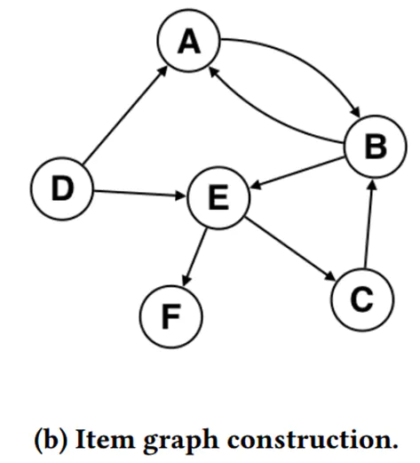
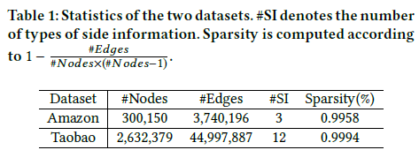

 
第44届国际计算机学会信息检索大会（The 44rd International ACM SIGIR Conference on Research and Development in Information Retrieval, SIGIR 2021）计划于今年7月11日-7月15日以线上会议形式召开。[这次会议](https://sigir.org/sigir2021/accepted-papers/)  共收到720篇长文和526篇短文投稿，有151篇长文和145篇短文被录用，录用率约为21%和27%。  
从词云图看今年SIGIR推荐系统的研究热点：根据长文和短文的标题绘制如下词云图，可以看到今年研究方向主要集中在Recommendation和Retrieval两个方向，也包括Summarization、Conversations等NLP方向；主要任务包括：Ranking、Cross-domain、Multi-Model/Behavior、Few-Shot、User modeling、Personalization等；热门技术包括：Neural Networks、Knowledge Graph、GNN、Attention、Meta Learning等，其中基于Graph的一类方法依旧是今年的研究热点。

《Billion-scale Commodity Embedding for E-commerce Recommendation in Alibaba》
====
节点分类（node classification）  
图分类（graph classification）  
边预测（link prediction）  
图的嵌入表示（graph embedding）  
从GCN
到DeepWalk、Line、Node2Vec  

|Algorithm	|Neighbor Expansion	|Optimization	
|------|----|----|
|DeepWalk 	|BFS					|hierarchical softmax 
|Line 		|Random				|negative sampling
|Node2Vec 	|BFS + DFS			|negative sampling
## 一、图形构建

### 1、通过用户行为构建item graph：

普通的CF方法只考虑了Items的共现，忽略了顺序信息。不需要考虑用户的所有浏览行为，只需要考虑用户时间窗口内的用户行为。
在淘宝的推荐中，时间窗口被经验设定为一小时，并对商品进行有向边的连接，因为用户是顺序浏览信息的。
通过淘宝所有用户的协同行为，为每条items的边分配一个权重，具体为item I转向item J的频数。
* 清理噪声数据：
	* 停留时间小于一秒的，可以认为是误点，需要移除
	* 对于过度活跃的用户，三个月内购买商品超过1000的或点击数超过3500的，可以认为是无效用户，需要移除。
	* 商家频繁修改商品信息的，造成前后id不一致的，需要移除。
	

  
如上图（a）用户U1具有***一个***有向商品回会话：`D->A->B`，用户U2具有***两个***有向商品会话：`B->E` & `D->E->F`，同理用户U3有***两个***有向商品会话``E->C->B``    
    
随即根据图（a）的用户行为可获得图（b）的有向图
	
### 2、Base Graph Embedding（BGE）：在带权有向图上进行随机游走
通过在图（b）的带权有向图上执行deepwalk，并采用负采样优化，获得item embedding

### 3、Graph Embedding with Side Information （GES）：使用side info的graph embedding
通过BGE将items映射到高维向量空间，并考虑了用户对于items的序列关系，但是仍然无法解决冷启动问题。  
为了解决冷启动问题，我们使用如category shop price等的side info赋值给不同的item，因为side info相同的两个item，理论上的embedding会更加接近。  
具体方式如下：
* 通过deepwalk获得item的游走序列，同时获得对应的side info的序列，
* 将所有序列放到word2vec模型中进行训练，针对每个item可以获得多种embedding：item_embedding，category_embedding，brand_embedding，price_embedding...
* 通过concat并取平均的方法获得最终的aggragated embedding

### 4、Enhanced Graph Embedding with Side Information （EGES）：
GES中的一个问题是针对每个item，没有考虑side infomation的权重，EGES就是让不同类型的side info具有不同的权重，最后得到一个加权平均的方法来aggragated 这些embedding
  
由于每个item对其不同side info的权重不一样，所以需要额外大小为v*(n + 1)的矩阵来表示每个item对便捷信息的权值。其中V是item的个数，n是side info的个数，+1是考虑item自身的权重。  
## 二、实验结果
### 1、离线测评
#### a 数据集
* Amazon Electronics数据集
* Taobao移动端APP抽取  
	对于Amazon数据集，item graph可以从“共同购买（co-purchasing）”的关系中被构建（在提供的数据中由also_bought表示），side info使用了三种类型：类目（category），子类目(sub-category)以及品牌。  
  	对于Taobao数据集，item graph通过第随机游走方法构建。注意，为了效率和效果，在Taobao真实生产环境中，使用了12种类型的side information，包括：零售商（retailer）, 品牌（brand）, 购买级别（purchase level）, 年代（age）, 适用性别（gender）, 风格（style）, 等等。
    
  上表反映了两个数据集的稀疏性大于99%。  
  
#### b、结果分析  
  
上表反映了GES和EGES在两个数据集上都要好于BGE和Line的相关算法。在Taobao数据集上提高更加显著，说明更多类型的有效的side info可以提供更多信息，聚合side info对于graph embedding更加有效，准确率可以通过多个side info的加权聚合而提升。
### 2、AB test
  
上图是淘宝在2017年双十一7天的CTR 进行的A/B Test结果，其中Base方法表示item-based的CF方法，在graph embedding之前被广泛应用于淘宝推荐系统中。  
从上图可以看到EGES和GES在CTR的效果要好于BGE和Base方法，这表示graph embedding聚合的side info带来的积极效果。EGES相较GES具有不错的效果，说明加权聚合的计算方式要好于平均聚合。  
### 3、冷启动
对于缺少用户行为的item，可以利用不同的side info信息有效学习其item embedding。

《Learning Effective and Efficient Embedding via an Adaptively-Masked Twins-based Layer》
====
标准的embeddings层将每个离散特征映射为相同长度的向量存在一些问题：
* 一方面，离散特征的不同取值在数据中的出现频次相差较大，对于高频词的特征取值，应当取更长长度的embedding向量表示更丰富的信息，对于低频次的特征取值，如果embedding过长，则容易导致过拟合。
* 相较于动态的embedding长度，定长的方式储存和计算的成本较高。  
当前的对于不定长的embbedding处理方式主要有两类：一类是基于规则的方法，对于频次高的特征，设置更长的embedding长度，对于频次较低的特征，设置较低的embedding长度。这种方式的主要问题的依赖于人工经验。另一类方法是基于神经架构搜索，这种方法是从候选的embedding长度中寻找每个特征最适合的长度，但候选长度往往被限制在有限的范围内。同时，上述两种方法都需要从头开始训练来寻找最适合的长度，不利于特征向量的热启动。

 
